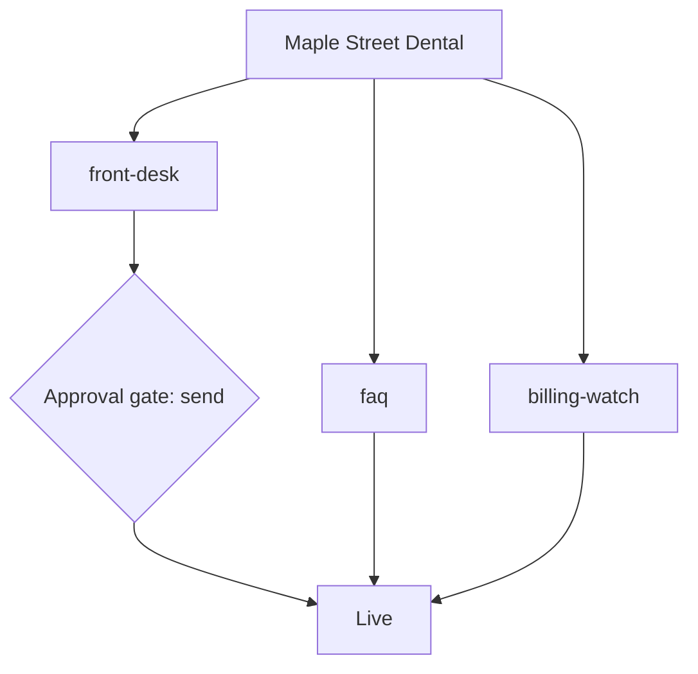

# Workflow Map — Maple Street Dental

Generated by `rollout-pack map`. Diamonds are approval gates: nothing crosses one without the lane's human owner.

```mermaid
flowchart TD
    B["Maple Street Dental"]
    LIVE["Live"]
    B --> L1["front-desk"]
    L1 --> G1_1{"Approval gate: send"}
    G1_1 --> LIVE
    B --> L2["faq"]
    L2 --> LIVE
    B --> L3["billing-watch"]
    L3 --> LIVE
```
